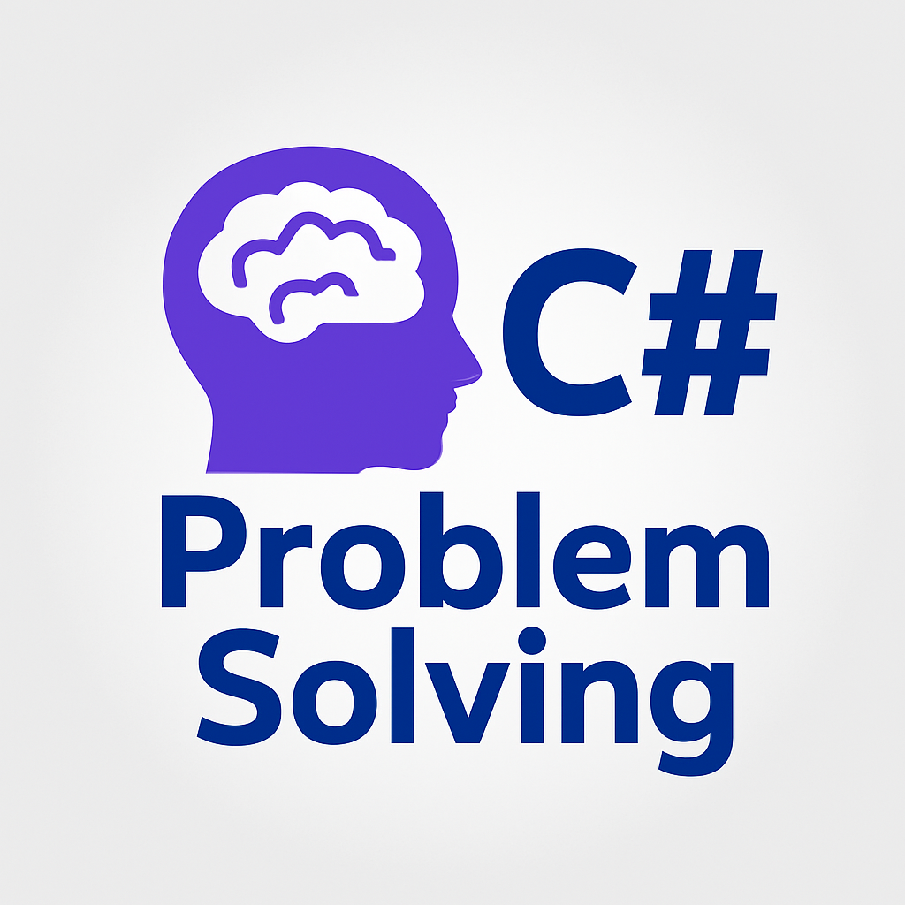

# csharp-problem-solving
C# problem-solving exercises focused on analytical thinking, clean coding, and divide-and-conquer techniques.


# 🎯 C# Problem Solving – Multi-Level Learning Journey

## 📘 Overview

This repository contains my **C# implementations** of structured programming exercises designed to strengthen **problem-solving**, **analytical thinking**, and **clean coding** skills.

The project is organized into multiple levels, each focusing on different aspects of **computational thinking** — from **breaking down problems** and applying the **divide-and-conquer approach** to writing **modular, maintainable, and efficient code**.

---

## 🧩 Level 1 – Problem Analysis and Breakdown
🔹 Description

* Level 1 includes 50 beginner-level problems that emphasize:

* Divide and Conquer thinking – breaking complex tasks into smaller parts.

* Developing analytical and logical reasoning.

* Practicing step-by-step problem decomposition.

* Strengthening foundational programming skills.

---

### 💡 Example Problem Topics

| # | Problem Title                         | Concepts Practiced                   |
| - | ------------------------------------- | ------------------------------------ |
| 1 | Rectangle Area Calculator             | Input/Output, function usage         |
| 2 | Circle Area Inside a Square           | Math formulas, constants             |
| 3 | Factorial Calculator                  | Loops, control flow                  |
| 4 | Simple Calculator                     | Enums, switch statements             |
| 5 | Time Converter (Hours → Days → Weeks) | Modular design, function composition |
| 6 | PIN Code Login                        | Loops, conditions, validation        |

---

## 🧠 Learning Goals

By completing this level, you will:

* Strengthen **problem-solving and logical reasoning**.
* Practice **divide-and-conquer** in simple programs.
* Write **modular and reusable functions**.
* Improve **clarity and structure** in C# code.
* Build a solid base for advanced topics.

---

## ⚙️ Technology Stack

* **Language:** C#
* **IDE:** Visual Studio 2022 / VS Code
* **Runtime:** .NET 6 or later
* **Paradigm:** Structured Programming

---

## 📁 Repository Structure

```
CSharp-ProblemSolving/
├── Level01-Fundamentals/
│   ├── 001-RectangleArea/
│   ├── 002-CircleAreaInsideSquare/
│   ├── 003-Factorial/
│   ├── 004-Calculator/
│   ├── 005-ConvertHoursDaysWeeks/
│   ├── 006-LoginSystem/
│   └── ...
└── README.md
```

---

## 🧭 Future Levels

Upcoming levels will progressively cover:

* **Data Structures** (arrays, lists, stacks, etc.)
* **Algorithm Design and Optimization**
* **Mathematical and Recursive Problems**
* **Mini-Applications and Real-World Scenarios**
